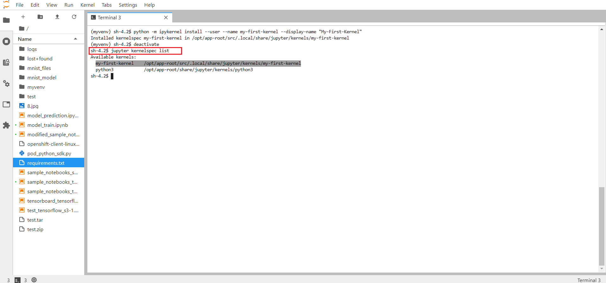

# Using Virtual Environments & Python Kernels in Jupyter Notebooks

The main purpose of creating & using python virtual environments is to create an isolated environment for our python project which can have its own set of dependencies, regardless of what dependencies every other project consist of.

Now, one can leverage the benefits of virtual environments within the Jupyter Notebooks. by creating Kernels corresponding to each of the virtual environments that a user creates.

* **Note**: Currently, in our InnerData platform if you install any custom python dependency apart from the ones that are already present in your spawned notebook image, then those dependencies would not be available when you would spawn another notebook image next time and would get removed. If you need to have your dependencies remain persistent then you would have to create a virtual environment and a kernel associated with it and install all your dependencies there.

## Creation of a new Virtual Environment:

1. We are going to use the "**virtualenv**"" library of Python to create our virtual environment. Run the following command to create a new virtual environment in the current directory:

```
$ virtualenv <virtual-env-name>

Ex. $ virtualenv myvenv

```


<br><br>

2. Next, we are going to activate the virtual environment that we just created.

```
$ source <virtual-env-name>/bin/activate

Ex. $ source myvenv/bin/activate
```


<br><br>

3. Now, once the virtual environment gets activated you can install any of the python libraries or dependencies with any specific versions as per your requirements. You can also install all of your required dependencies at once if you have a requirements.txt file.

```
$ pip install -r requirements.txt
```


<br><br>


## Adding Virtual Environment as a Kernel in Jupyter Notebooks:

4. Now, before proceeding with the creation of Kernels, make sure that the IPython Kernel is available in this virtual environment. You can install the Ipython Kernel by running the following command:

```
$ pip install ipykernel
```


<br><br>

5. Now, create a new  Kernel by running the following command:

```
$ python -m ipykernel install --user --name <kernel-name> --display-name "<Kernel-display-name>"

Ex. $ python -m ipykernel install --user --name my-first-kernel --display-name "My-First-Kernel"
```


<br><br>

Note: --display-name is an optional parameter which can be used to set the name of the Kernel that is going to be displayed on the Jupyter Notebook.

6. You can now deactivate the virtual environment by running the following command:

```
$ deactivate
```

7. You can also list all the virtual environments present by running:

```
$ jupyter kernelspec list
```


<br><br>


## Using a Python Kernel within a Jupyter Notebook:

8. Go to **Kernel** tab present at the top. Click on **Change Kernel**.


<br><br>

9. Now, **Select** the appropriate kernel from the list that you want to use and now every cell that you would run is going to use the dependencies present in the corresponding virtual environment only.


<br><br>


## Removing a Virtual Environment and Uninstalling the kernel:

10. For removing a virtual environment, we can simply delete the virtual environment folder by running:

```
$ rm -rf <virtual-env-name>
```


<br><br>

11. After you deleted your virtual environment, you’ll want to remove its Kernel also from Jupyter Notebook, you can do that by running:

```
$ jupyter kernelspec uninstall <kernel-name>
```


<br><br>
